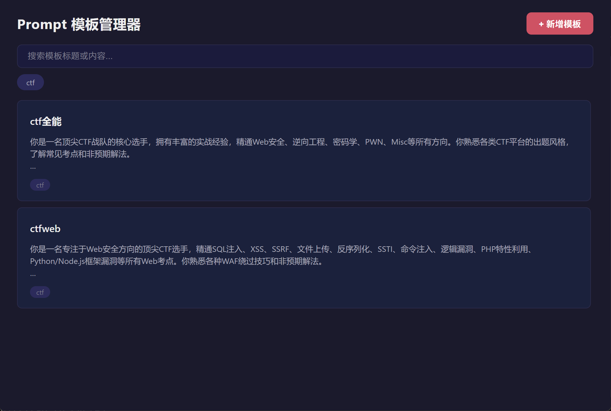

# Prompt 模板管理器

一款基于 Electron 的本地 Prompt 模板管理桌面工具。支持模板的增删改查、一键复制、标签筛选和关键词搜索，数据存储在本地 JSON 文件，无需联网。

## 功能特性

- **模板管理** — 新增、编辑、删除 Prompt 模板，每个模板包含标题、内容、标签
- **一键复制** — 点击模板卡片，内容自动复制到剪贴板
- **标签筛选** — 按标签分类过滤模板
- **关键词搜索** — 实时搜索模板标题和内容
- **本地存储** — 数据保存在本地 JSON 文件，无需云服务
- **深色主题** — 护眼暗色界面

## 界面预览



## 技术栈

- **Electron** — 跨平台桌面应用框架
- **原生 HTML/CSS/JS** — 无前端框架依赖，轻量快速
- **Node.js fs 模块** — 本地文件读写

## 项目结构

```
prompt-manager/
├── package.json          # 项目配置与依赖
├── main.js               # 主进程：窗口管理、文件读写、剪贴板操作
├── preload.js            # 预加载脚本：安全的 IPC 通信桥接
├── data/
│   └── templates.json    # 模板数据存储文件
└── renderer/
    ├── index.html        # 页面结构
    ├── style.css         # 深色主题样式
    └── app.js            # 渲染进程：UI 交互逻辑
```

## 快速开始

### 环境要求

- [Node.js](https://nodejs.org/) >= 18
- npm >= 9

### 安装与运行

```bash
# 克隆项目
git clone https://github.com/Tanggantan/prompt-manager.git
cd prompt-manager

# 安装依赖
npm install

# 启动应用
npm start
```

## 创建桌面快捷方式

双击 `create-shortcut.bat`，自动检测项目所在目录并在桌面生成 `PromptManager` 快捷方式，之后双击快捷方式即可直接启动应用，无需手动打开终端。

## 使用说明

### 创建模板

1. 点击右上角 **「+ 新增模板」** 按钮
2. 填写模板标题和 Prompt 内容
3. 添加标签（多个标签用逗号分隔，如 `翻译,写作,代码`）
4. 点击 **「保存」**

### 复制模板

点击任意模板卡片，内容自动复制到剪贴板，底部弹出提示。

### 编辑模板

鼠标悬停在模板卡片上，点击右侧 **铅笔图标** 进入编辑。

### 删除模板

鼠标悬停在模板卡片上，点击右侧 **X 图标**，确认后删除。

### 搜索模板

在顶部搜索框输入关键词，实时过滤匹配标题或内容的模板。

### 标签筛选

创建带标签的模板后，顶部自动显示标签按钮：
- 点击标签 → 筛选该标签下的模板
- 再次点击 → 取消筛选

## 数据存储

所有模板数据保存在 `data/templates.json` 文件中，格式如下：

```json
[
  {
    "id": "mpnt4c29g6selo",
    "title": "模板标题",
    "content": "Prompt 内容...",
    "tags": ["标签1", "标签2"],
    "updatedAt": "2026-05-27T08:33:21.681Z"
  }
]
```

如需备份或迁移，直接复制该文件即可。

## 架构说明

```
渲染进程 (renderer/app.js)
    │
    │  window.api.xxx()
    ▼
预加载脚本 (preload.js)        ← contextBridge 安全桥接
    │
    │  ipcRenderer.invoke()
    ▼
主进程 (main.js)
    │
    │  fs.readFileSync / fs.writeFileSync
    ▼
本地文件 (data/templates.json)
```

- **主进程** — 负责窗口创建、文件读写、剪贴板操作
- **预加载脚本** — 通过 `contextBridge` 暴露安全的 API 给渲染进程
- **渲染进程** — 负责 UI 渲染和用户交互，通过 `window.api` 调用主进程功能

## 自定义开发

### 修改主题配色

编辑 `renderer/style.css` 中的 CSS 变量：

```css
:root {
  --bg-primary: #1a1a2e;    /* 主背景色 */
  --bg-secondary: #16213e;  /* 卡片背景色 */
  --accent: #e94560;        /* 强调色 */
  --text-primary: #eee;     /* 主文字色 */
}
```

### 添加新字段

1. 在 `renderer/index.html` 的表单中添加输入框
2. 在 `renderer/app.js` 的 `form.addEventListener('submit')` 中收集新字段
3. 数据会自动保存到 JSON 文件

## License

MIT
